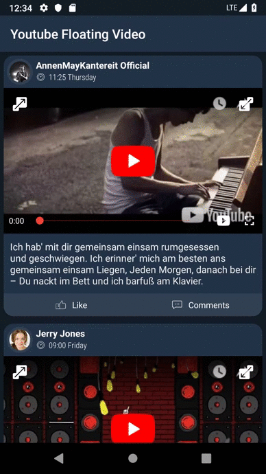

# Youtube Floating Video - FlyingVideo

[](https://app.codacy.com/app/AsynctaskCoffee/YoutubeFloatingVideo?utm_source=github.com&utm_medium=referral&utm_content=AsynctaskCoffee/YoutubeFloatingVideo&utm_campaign=Badge_Grade_Dashboard)

> Easy to use floating Youtube Video Library
> More features will be added in upcoming days

### Why this project exist ?
Picture in picture has become popular these days. Unfortunately Android brought this support to Android 8.0 (API level 26) and later versions. Pip and floating video supported apps offer users the ability to easily view other features while watching videos (Like reading comments etc). With this library you can play youtube videos in a floating panel. I have just started to develop this library and I am open to all your ideas and opinions.

## Features and Usage

### Easy implementation 

`view` can be any Button, Imageview or ImageButton which activate the FlyingVideo. `videoId` should have an ID of your YouTube video. For simply:

```java
  FlyingVideo.get(MainActivity.this)
                .setFloatMode(TaskCoffeeVideo.FLOAT_MOVE.STICKY)
                .setVideoStartSecond((mTracker == null) ? 0 : mTracker.getCurrentSecond())
                .coffeeVideoSetup(videoId)
                .show(view);
```
 


### Sticky and Free Mode

#### Sticky FLOAT_MOVE

FlyingVideo automatically snaps up or down according to the position of the screen where you left the panel.

```java
  FlyingVideo.get(MainActivity.this)
                .setFloatMode(TaskCoffeeVideo.FLOAT_MOVE.STICKY)
                .setVideoStartSecond((mTracker == null) ? 0 : mTracker.getCurrentSecond())
                .coffeeVideoSetup(videoId)
                .show(view);
```


#### Free FLOAT_MOVE

FlyingVideo never sticks on constant position, it stays on the position where you left.

```java
    FlyingVideo.get(MainActivity.this)
                .setFloatMode(TaskCoffeeVideo.FLOAT_MOVE.FREE)
                .setVideoStartSecond((mTracker == null) ? 0 : mTracker.getCurrentSecond())
                .coffeeVideoSetup(videoId)
                .show(view);
```

 

### Initial FlyGravity Mode

#### BOTTOM FlyGravity


FlyVideo appears bottom of the screen when opened.

```java
    FlyingVideo.get(MainActivity.this)
                .setFloatMode(TaskCoffeeVideo.FLOAT_MOVE.FREE)
                .setVideoStartSecond((mTracker == null) ? 0 : mTracker.getCurrentSecond())
                .coffeeVideoSetup(videoId)
                .setFlyGravity(TaskCoffeeVideo.FLY_GRAVITY.BOTTOM)
                .show(view);
```

#### TOP FlyGravity

FlyVideo appears top of the screen when opened.

```java
    FlyingVideo.get(MainActivity.this)
                .setFloatMode(TaskCoffeeVideo.FLOAT_MOVE.FREE)
                .setVideoStartSecond((mTracker == null) ? 0 : mTracker.getCurrentSecond())
                .coffeeVideoSetup(videoId)
                .setFlyGravity(TaskCoffeeVideo.FLY_GRAVITY.TOP)
                .show(view);
```

 


### Updates

> 13.07.2020 AndroidX Migration

> FullScreen Support Added

#### Full Screen Usage

> Users who are already using do not need to make any changes. Users who want to use full screen feature should get [YoutubeApi key](https://developers.google.com/youtube/v3/getting-started). Users without YouTube or devices without PlayStore support are directed to webview for full screen mode.

```java
        setFullScreenToggleEnabled(true, "-YOUR-YOUTUBE-API-KEY-")
```

```java
FlyingVideo.get(MainActivity.this)
        .setFloatMode(TaskCoffeeVideo.FLOAT_MOVE.FREE)
        .setFullScreenToggleEnabled(true, "-YOUR-YOUTUBE-API-KEY-")
        .setVideoStartSecond((mTracker == null) ? 0 : mTracker.getCurrentSecond())
        .coffeeVideoSetup(videoId)
        .setFlyGravity(TaskCoffeeVideo.FLY_GRAVITY.BOTTOM)
        .show(view);
```

## Implementation

###### Add it in your root build.gradle at the end of repositories:

```
allprojects {
		repositories {
			...
			maven { url 'https://jitpack.io' }
		}
	}
```

###### Add the dependency

```
dependencies {
	        implementation 'com.github.AsynctaskCoffee:YoutubeFloatingVideo:0.0.5'
	}
```

### Used Libraries

* **Henning Dodenhof** - *Circular ImageView* - [hdodenhof](https://github.com/hdodenhof/CircleImageView)
* **Pierfrancesco Soffritti** - *android-youtube-player* - [PierfrancescoSoffritti](https://github.com/PierfrancescoSoffritti/android-youtube-player)

#### NOTE:

This library is designed not to violate the rules. However, all problems that may occur are under your responsibility.

Before publishing your app to GooglePlay please make sure that you have read Youtube and Google Terms;
* [Terms](https://developers.google.com/youtube/terms/developer-policies)


## License

```
   Copyright 2020 Egemen ÖZOGUL

   Licensed under the Apache License, Version 2.0 (the "License");
   you may not use this file except in compliance with the License.
   You may obtain a copy of the License at

       http://www.apache.org/licenses/LICENSE-2.0

   Unless required by applicable law or agreed to in writing, software
   distributed under the License is distributed on an "AS IS" BASIS,
   WITHOUT WARRANTIES OR CONDITIONS OF ANY KIND, either express or implied.
   See the License for the specific language governing permissions and
   limitations under the License.
```
